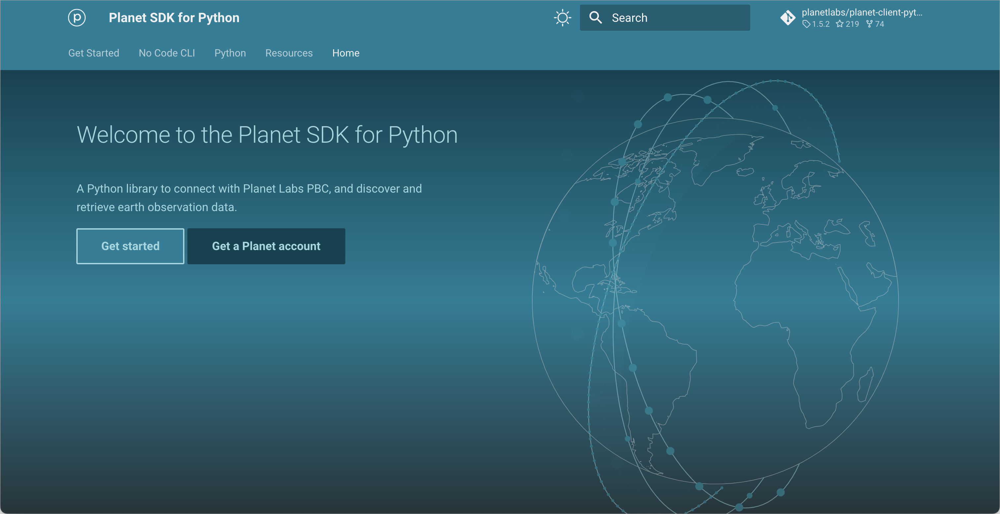
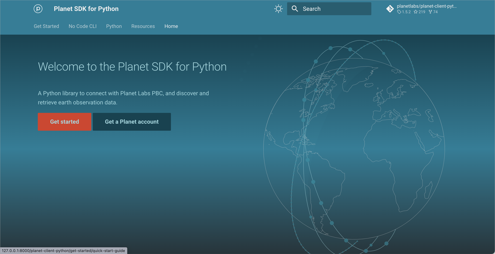
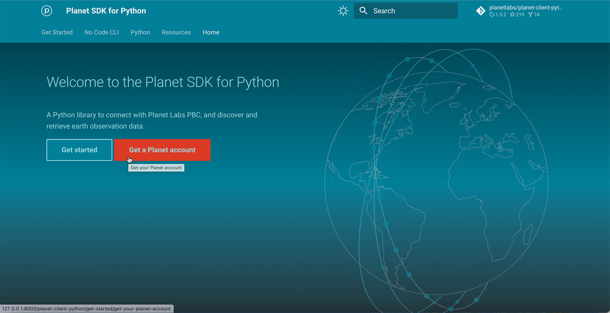
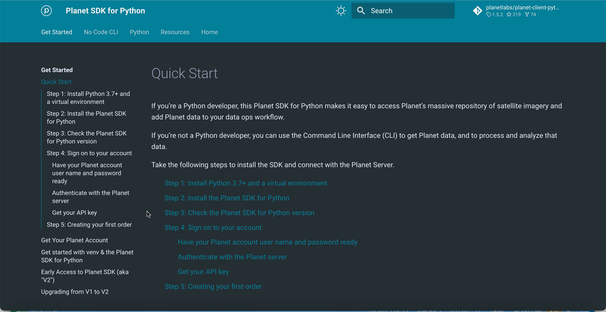
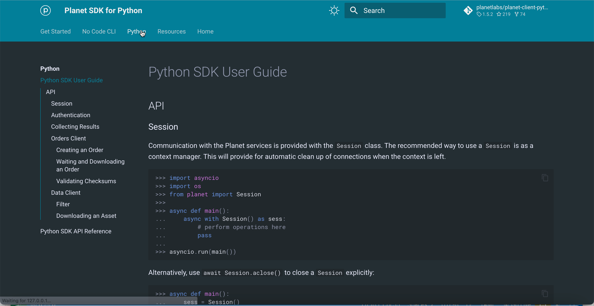
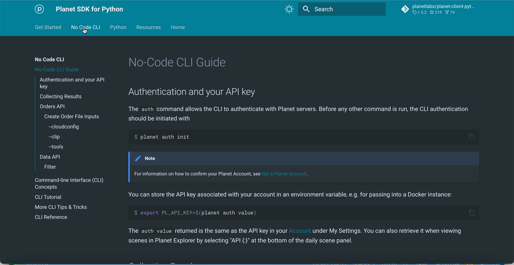
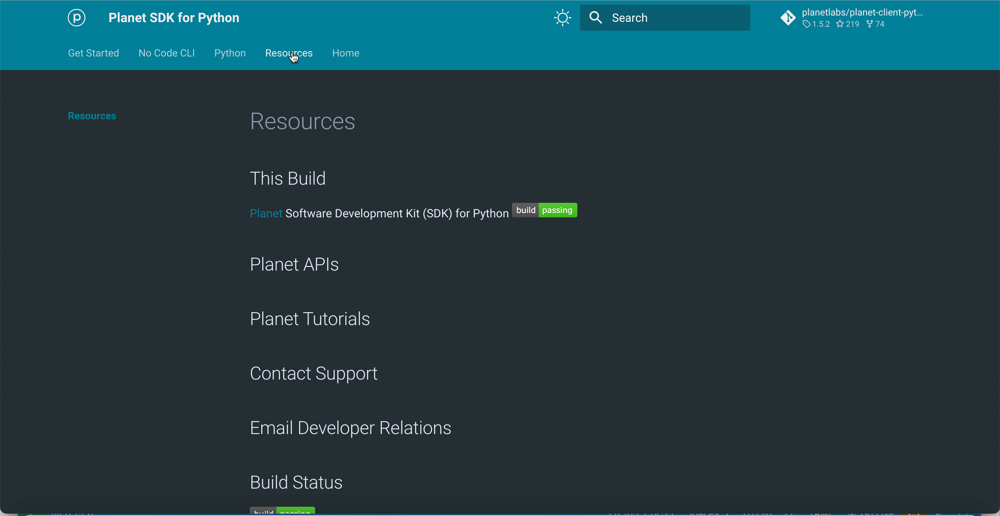

# Create a Getting Started Experience (GSX)

We'd like to make sure folks who come to the docs site can get started easily. We'd like them to know how to:

* Get an API key
* Authenticate against the service
* Search and download data using the CLI
* Search and download data using the Python calls
* Find key content and support

# A clear top nav will help with the GSX

## Here are some mockups of the global nav changes:

### Home splash screen







### Getting started landing page



### Python landing page



### CLI landing page



### Resources landing page



## Add a clear top nav to mkdocs materials using a custom home page

" if the theme.custom_dir configuration value is used in combination with an existing theme, the theme.custom_dir can be used to replace only specific parts of a built-in theme" 

"built-in themes are implemented in a base.html file, which main.html extends"

[mkdocs.org dev-guide themes ](https://www.mkdocs.org/dev-guide/themes/)

### Create a custom theme

1. Create a main jinga template file that is not a child of docs, as in:

```custom_theme/main.html```

2. Add that custom dir to the mkdocs.yml file, under `theme`:

```custom_dir: 'custom_theme/'```

3. Add metadata to docs/index.md:

```
---
title: Title
template: home.html
---
```


### Notes

[Developing Themes : A guide to creating and distributing custom themes.](https://www.mkdocs.org/dev-guide/themes/)

[Steps to creating a similar homepage](https://github.com/squidfunk/mkdocs-material/issues/1996#issuecomment-855086383)

[Template Designer Documentation](https://jinja.palletsprojects.com/en/3.1.x/templates/)


### Open questions

#### will we ever distribute theme? If so, then:

["when a theme is packaged up for distribution, and loaded using the theme.name configuration option, then a mkdocs_theme.yml file is required for the theme."](https://www.mkdocs.org/dev-guide/themes/)